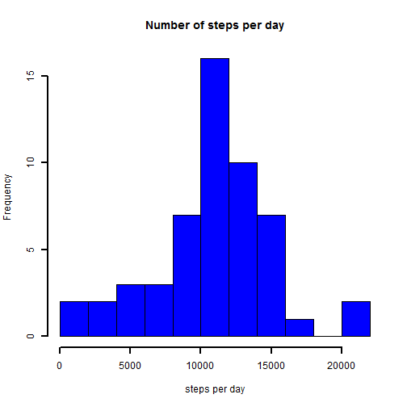
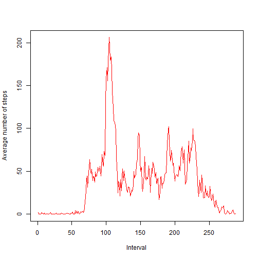
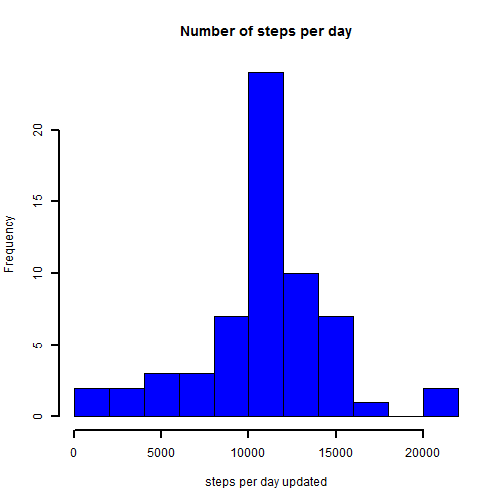
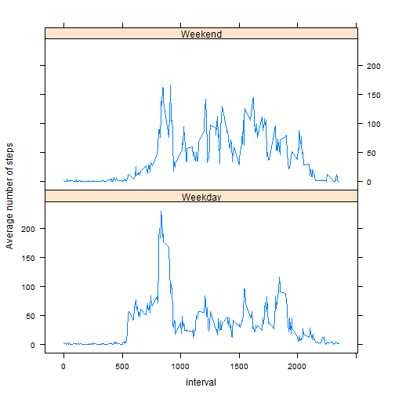

This document represents report for the project on Peer Assessment 1 of course [Reproducible Research](https://class.coursera.org/repdata-010) which can be found on [Coursera](http://www.coursera.org)    

###Loading and preprocessing the data  


Load the data

```r
  data<-read.csv("activity.csv")
  head(data)
```

```
##   steps       date interval
## 1    NA 2012-10-01        0
## 2    NA 2012-10-01        5
## 3    NA 2012-10-01       10
## 4    NA 2012-10-01       15
## 5    NA 2012-10-01       20
## 6    NA 2012-10-01       25
```
Process/transform the data (if necessary) into a format suitable for analysis.  
Here I convert date field from factor to date class.

```r
  data$date<-as.Date(as.character(data$date))
```
###What is mean total number of steps taken per day?
Histogram of the total number of steps taken each day. 

```r
  sumdaysteps<-tapply(data$steps,data$date,sum)
  hist(sumdaysteps,xlab="steps per day",col="blue",lwd=2,breaks=10,
       main="Number of steps per day")
```

 

Calculate and report the mean and median total number of steps taken per day.  
Mean

```r
  mean_steps_per_day<-mean(sumdaysteps,na.rm=T)
  mean_steps_per_day
```

```
## [1] 10766.19
```
Median

```r
  median_steps_per_day<-median(sumdaysteps,na.rm=T)
  median_steps_per_day
```

```
## [1] 10765
```

###What is the average daily activity pattern?
Make a time series plot (i.e. type = "l") of the 5-minute interval (x-axis) and the average number of steps taken, averaged across all days (y-axis).

```r
  stepsininterval<-tapply(data$steps,data$interval,mean,na.rm=TRUE)
  plot(stepsininterval,type="l",col="red",xlab="Interval", ylab = "Average number of steps")
```

 

Which 5-minute interval, on average across all the days in the dataset, contains the maximum number of steps?

```r
  max_interval<-as.numeric(names(which.max(stepsininterval)))
  max_interval
```

```
## [1] 835
```

###Imputing missing values
Calculate and report the total number of missing values in the dataset (i.e. the total number of rows with NAs)

```r
  missing_values_number<-sum(is.na(data$steps))
  missing_values_number
```

```
## [1] 2304
```
My strategy for filling in all of the missing values in the dataset - use mean for corresponding 5-minute interval.   
Create a new dataset that is equal to the original dataset but with the missing data filled in.

```r
  data1<-data
    for (i in 1:nrow(data1)) {
    if (is.na(data1$steps[i])) {
      data1$steps[i]<-stepsininterval[as.character(data$interval[i])]
    }
  }
  head(data1)
```

```
##       steps       date interval
## 1 1.7169811 2012-10-01        0
## 2 0.3396226 2012-10-01        5
## 3 0.1320755 2012-10-01       10
## 4 0.1509434 2012-10-01       15
## 5 0.0754717 2012-10-01       20
## 6 2.0943396 2012-10-01       25
```
Make a histogram of the total number of steps taken each day.

```r
  sumdaysteps_update<-tapply(data1$steps,data1$date,sum)
  hist(sumdaysteps_update,xlab="steps per day updated",col="blue",
       lwd=2,breaks=10,main="Number of steps per day")
```

 

Calculate and report the mean and median total number of steps taken per day. Do these values differ from the estimates from the first part of the assignment?  
Mean

```r
  mean_steps_per_day_update<-mean(sumdaysteps_update)
  mean_steps_per_day_update
```

```
## [1] 10766.19
```
Median

```r
  median_steps_per_day_update<-median(sumdaysteps_update,na.rm=T)
  median_steps_per_day_update
```

```
## [1] 10766.19
```
We see that after filling the data mean and median are equal to each other. Mean is the same to obtained before imputing of data, median slightly differs.    

###Are there differences in activity patterns between weekdays and weekends?    
Create a new factor variable in the dataset with two levels – “weekday” and “weekend” indicating whether a given date is a weekday or weekend day.

```r
  wdays <- c("Monday","Tuesday","Wednesday","Thursday","Friday")
  data1$day<-weekdays(data1$date)
  data1$dayweek<-as.factor(ifelse(data1$day %in% wdays,"Weekday","Weekend"))
```
Make a panel plot containing a time series plot (i.e. type = "l") of the 5-minute interval (x-axis) and the average number of steps taken, averaged across all weekday days or weekend days (y-axis). 

```r
  stepsininterval_by_day<-with(data1,aggregate(steps,
                                    by=list(interval,dayweek),mean))
  names(stepsininterval_by_day)<-c("interval","dayweek","steps")
  library(lattice)
  xyplot(steps ~ interval | dayweek, stepsininterval_by_day, type = "l", layout = c(1, 2), 
         ylab = "Average number of steps")
```

 


